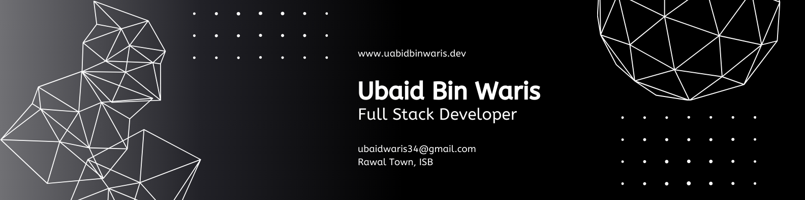

<h1 align="center">Hi, I'm Ubaid Bin Waris</h1>

<b>Full Stack Developer • System Programming Enthusiast • Problem Solver</b>

  

### Showcasing Innovation Through Code
*From real-time applications to system-level programming - every project tells a story of innovation*

  
  
  

---

## Crafting Digital Solutions That Make an Impact

*Passionate about building scalable **web applications**, modern **UIs**, and exploring **system-level programming***

### About Me

Passionate Computer Science student building scalable web apps & exploring system-level programming.  
Skilled in **Next.js, React, Node.js, MongoDB**.  
Linux enthusiast (Ubuntu, Fedora, Arch).  
Strong foundation in **C++ (DSA)** & **Assembly**.

 

---

## Tech Arsenal

*Mastering the tools that build tomorrow's digital solutions*

### Frontend Technologies

  

---

### Backend & Database

  

---

### Tools & DevOps

  

---

## Featured Projects Portfolio

*Building tomorrow's solutions with today's technology*

### Echo Chat Application
[Live Demo](#) | [Source Code](#)  
**Tech Stack:** React • Node.js • Socket.io • MongoDB  
**Key Features:** Real-time messaging, secure authentication, multiple chat rooms

### Spotify Clone Platform
[Live Demo](#) | [Source Code](#)  
**Tech Stack:** React • Node.js • Express • MongoDB  
**Key Features:** Custom audio playbar, playlist management, streaming engine

### Smart Car Challan System
[Source Code](#)  
**Tech Stack:** C++ • OOP • Encryption • File System  
**Key Features:** Vehicle violation tracking, data encryption, multi-file architecture

### University Management System
[Live Demo](#) | [Source Code](#)  
**Tech Stack:** Next.js • SQL • API • Responsive Design  
**Key Features:** Student portal, admin dashboard, database management

### Interior Design E-commerce
[Live Demo](#) | [Source Code](#)  
**Tech Stack:** React • Node.js • MongoDB • Payment Gateway  
**Key Features:** Product catalog, shopping cart, secure authentication

---

## Innovation Pipeline

### Coming Soon: AI-Powered Analytics Dashboard
**Next-Generation Data Intelligence**

**Upcoming Tech Stack:** React • Python • TensorFlow • FastAPI  
**Planned Features:** AI insights, real-time analytics, predictive modeling

---

## GitHub Analytics  

  

### **Code Journey & Impact**

  
  

  
  

  

---

## Connect & Collaborate

### **Let's Build Something Amazing Together!**

**Open for collaborations, freelance projects, and tech discussions**

  
  
  
  
  
  
  
  

###  **Available For:**
- **Freelance Web Development Projects**
- **Game Development Collaborations**
- **Open Source Contributions**
- **Full-time Opportunities**
- **Mentoring & Code Reviews**

---

## Fun Facts & Personal Touch

### **What Drives Me**

### Development Philosophy
- Code quality matters: clean, efficient, and maintainable solutions
- Continuous learner, exploring new technologies and frameworks
- Advocate of open source and collaborative development
- Security-first approach in every project

### Daily Inspirations
- Work best with coffee and focus
- Enjoy coding with music in the background
- Passion for system design and architecture
- Dedicated to Linux customization and open-source tools

### **Developer Quote**
*"The best way to predict the future is to create it."* - Alan Kay

### **Based in Islamabad, Pakistan**
**Available for remote work and global collaborations**

---

### **Let's Connect & Create Something Amazing!**

**Crafted with passion and precision by [Ubaid Bin Waris](https://github.com/UbaidBinWaris)**

  

*"Code is poetry written in logic, and every project is a masterpiece waiting to be created."*

<strong>If you like my work, consider giving my repositories a star — it helps and motivates me!</strong>

---

<!--
SEO Keywords: 
MERN Developer • Full Stack Web Developer • Next.js Specialist • React.js Engineer • Remote Software Engineer • Backend Developer • Frontend Developer • JavaScript Developer • Node.js Developer • Express.js Developer • MongoDB Specialist • Web Application Developer • API Developer • Database Architect • Software Engineer for Hire • Freelance Developer • Remote MERN Stack Developer • Open Source Contributor • System Programming Enthusiast • Linux Developer • Cloud Computing Specialist • Cybersecurity Enthusiast • UI/UX Developer • Tailwind CSS Expert • Responsive Web Design Specialist • Modern Web Development • Full Stack Engineer Remote • React and Next.js Professional • Open Source Software Contributor • Database Management • SQL and NoSQL Expert • REST API Developer • GitHub Developer Portfolio • Freelance Software Engineer Remote • Full Stack Projects • University Management System Developer • E-commerce Website Developer • Portfolio Website Developer • Operating System Projects • C++ Developer • Assembly Language Programmer • DSA Enthusiast • Game Developer with Unity and Unreal Engine • C# Game Developer • Arch Linux User • Backend Engineer Remote • Custom Linux Distribution Builder • AI and Machine Learning Enthusiast • Text-to-Code AI Researcher • Research-based Software Projects • Scalable Web Applications • Secure Authentication Systems • Performance Optimization Expert • API Integration Specialist • Software Design and Architecture • ViciDial-like Calling Software Developer • ER Diagram and System Architecture Designer • Blog Website Developer • Three.js Portfolio Specialist • Responsive Next.js Web Design • Remote Freelance Web Developer
-->

